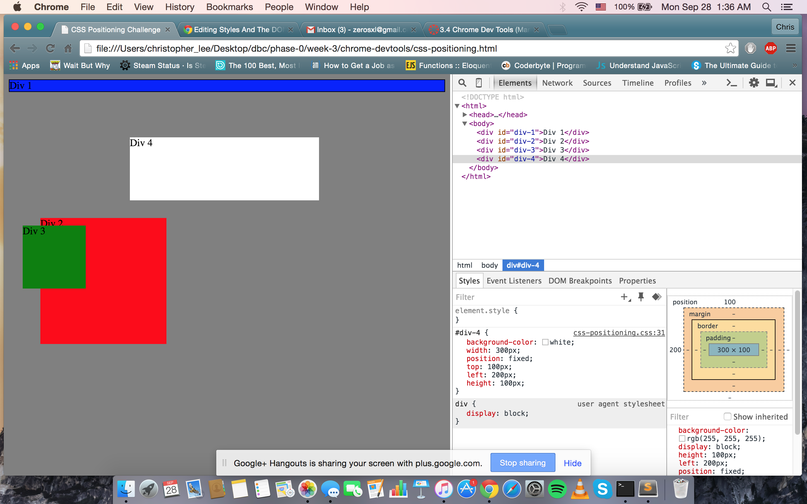
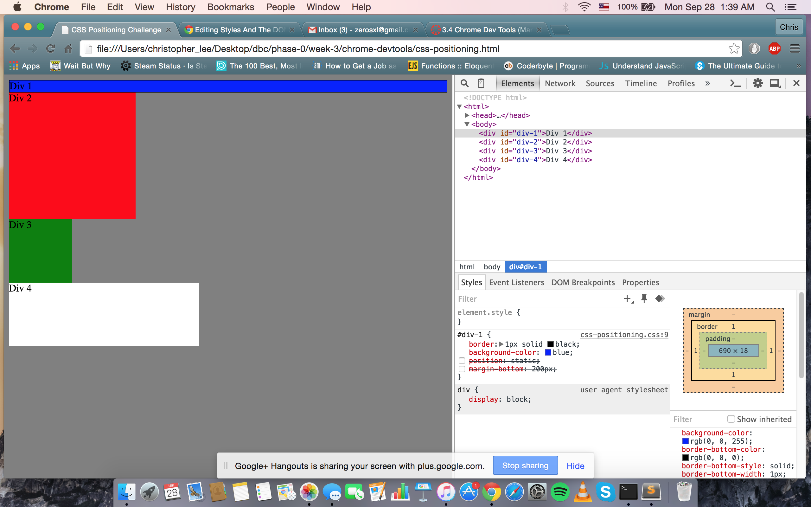
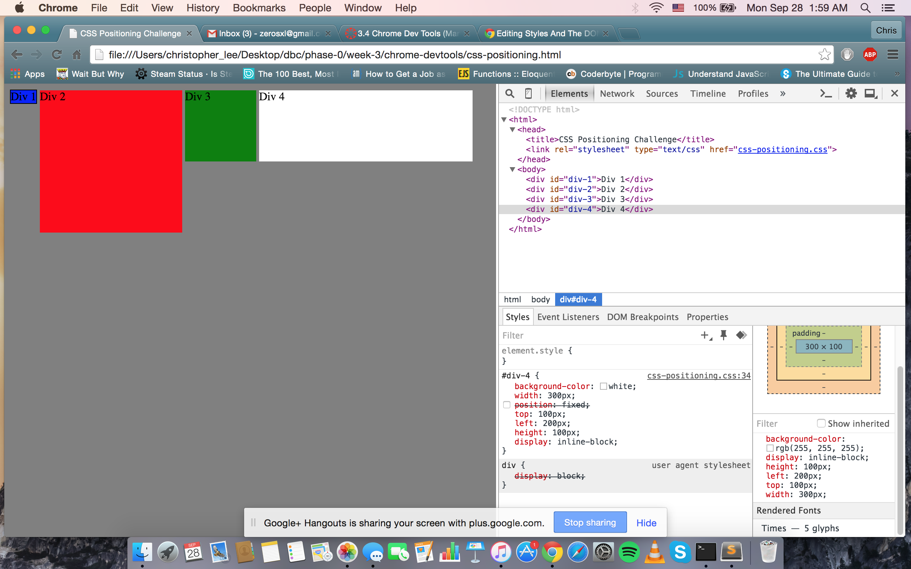
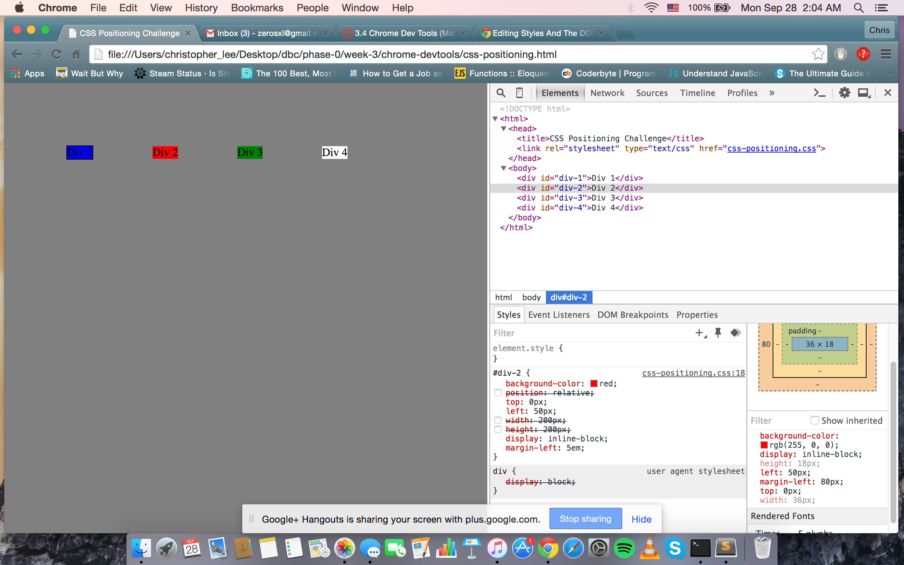
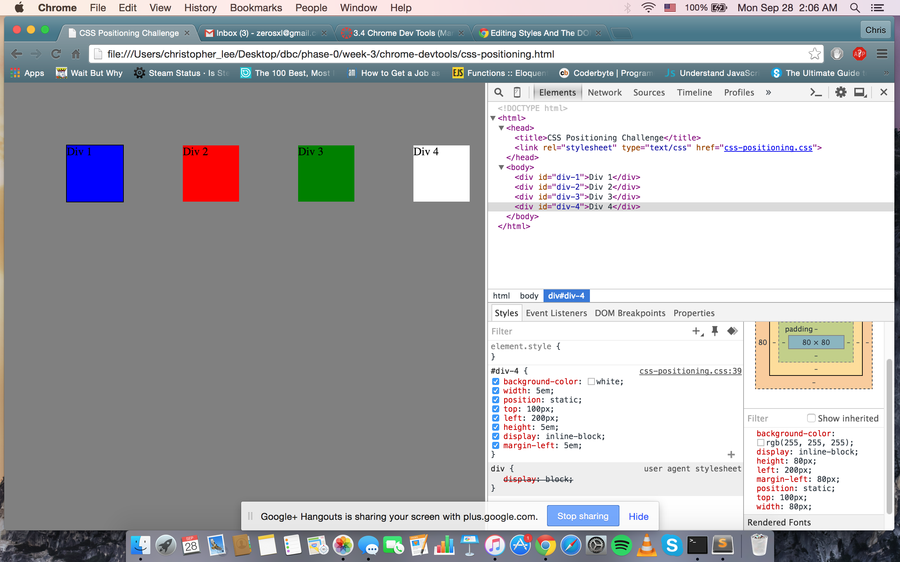
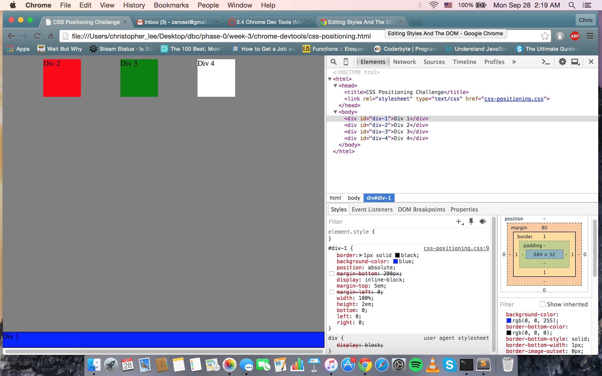
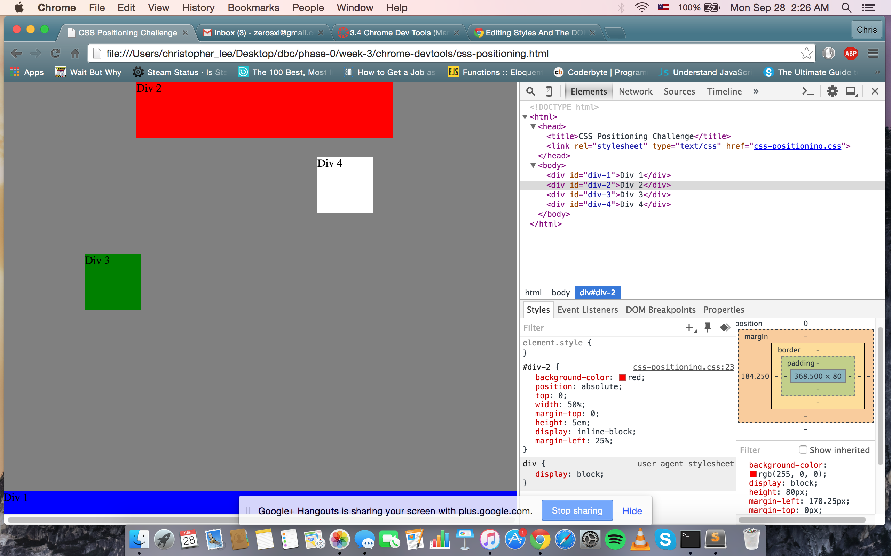
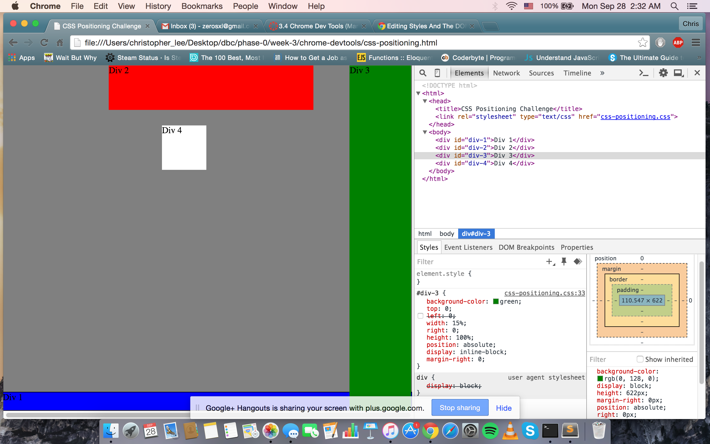
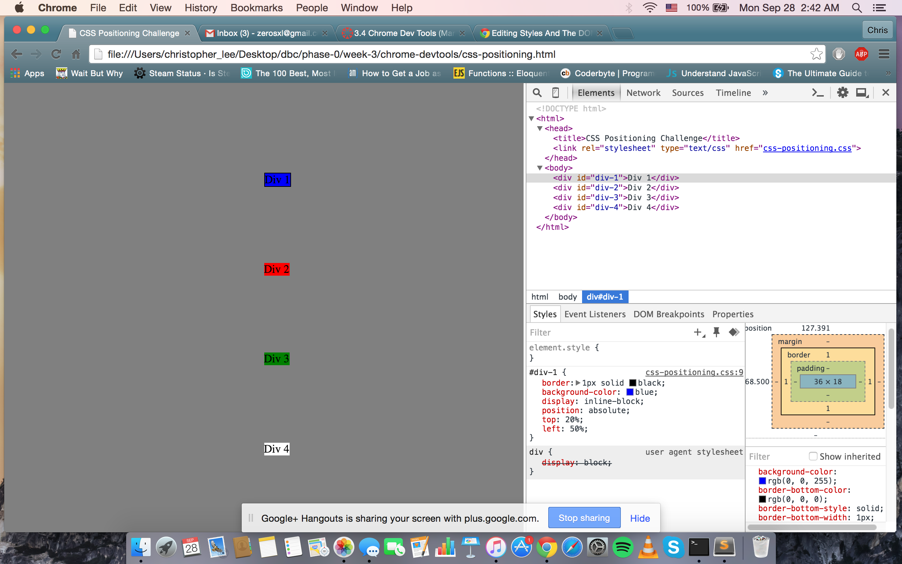

How can you use Chrome's DevTools inspector to help you format or position elements?
Chrome's devtools is a powerful DOM inspector with a great visual representation of what is going on in a webpage. You can highlight individual elements and edit them within devtools. You can change margins, positiong, and a variety of different aspects that change the appearance of the elements.
How can you resize elements on the DOM using CSS?
You can input size values in percentages, em, and px. It is a versatile tool for sizing the elements as needed per webpage.
What are the differences between Absolute, Fixed, Static, and Relative positioning? Which did you find easiest to use? Which was most difficult?
Static is the default for all page elements. It means elements flow as they normally would. Absolute is a powerful type of positioning that places any element on any part of the webpage exactly as intended without interference from other elements. Fixed allows elements to stay the same relative to the viewport - meaning if a user scrolls, that element will stay in the same location in the new view. Relative can be a difficult positioning tool. Relative elements require other relative elements to be utilized properly.
What are the differences between Margin, Border, and Padding?
Padding = a transparent area around the content. Border = a border that goes around the content / padding. Margin = The transparent area around the border.
What was your impression of this challenge overall? (love, hate, and why?)
Was annoying at times. I felt like it should have been an easier exercise, but was made difficult for no good reason.

