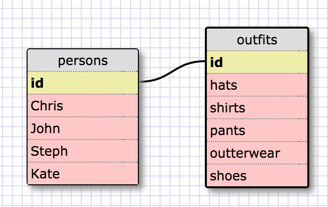

SELECT * FROM STATES;

select * from regions;

select state_name, population from states;

select state_name, population from states order by population desc;

select state_name from states where region_id = 7;

select state_name, population_density from states where population_density > 50 order by population_density asc;

select state_name from states where population between 1000000 and 1500000;

select state_name, region_id from states order by region_id asc;

select region_name from regions where region_name like '%Central%';

select regions.region_name, states.state_name from regions inner join states on states.region_id = regions.id order by region_id asc;

What are databases for?

Databases are an organized, easily accessible way of storing and retreiving data. Even data manipulation at a higher level.

What is a one-to-many relationship?

Is describing a relationship between tables of data. For one "key" in a table there may be references to many data instances in the linked table.

What is a primary key? What is a foreign key? How can you determine which is which?

The primary key is describing the core data column. It is usually determined by practicality of accessing the data through SQL or references the most important data information or both.

How can you select information out of a SQL database? What are some general guidelines for that?

Using the SQL language and the DBMS we can specialize commands to filter specific sets of data.