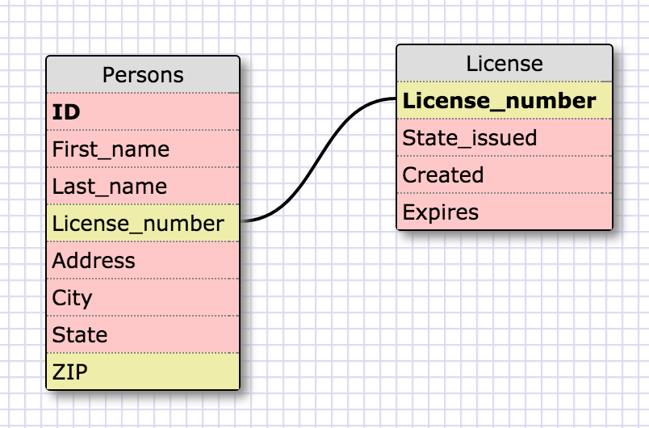
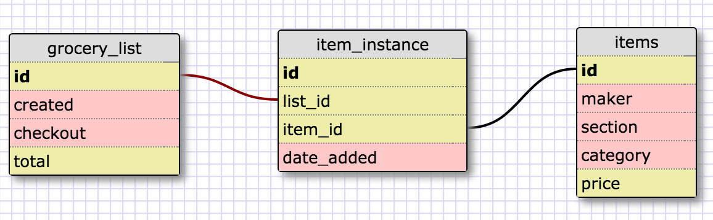

This schema depicts one the DMV may have. Each person has just once license and a license is unique to a specific person.

What is a one-to-one database?

A one to one database is a pair of tables that co-exist.

When would you use a one-to-one database? (Think generally, not in terms of the example you created).

One to one is reserved for datasets that are mutually exclusive.

What is a many-to-many database?

When two distinct data sets are joined by a join table.

When would you use a many-to-many database? (Think generally, not in terms of the example you created).

Many to many is necessary when several data values overlap between two tables.

What is confusing about database schemas? What makes sense?

Databases seem easy in principle, but I can only imagine extremely large data sets... how confusing it must all be. At the same time, they make so much sense because it seems like a very organized way to store / access data.